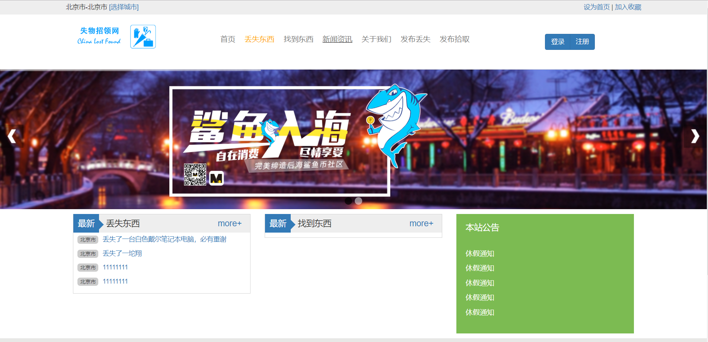
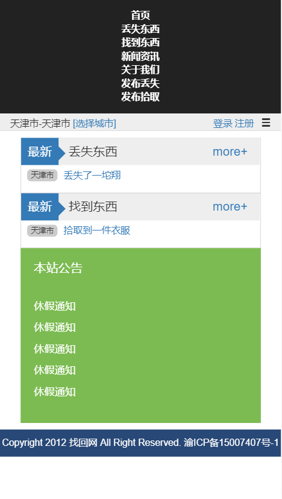
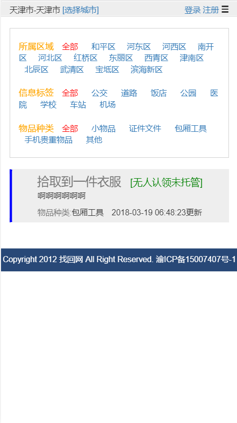
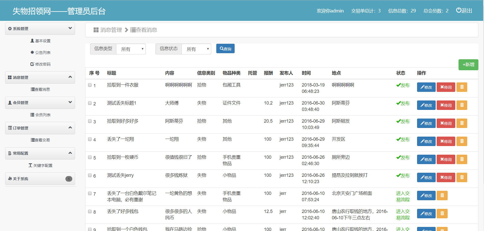

# 响应式失物招领网站

## 前言

今天无意中看到了很久以前写的项目，已经不是最新版本代码了，在本地跑了下，感觉还ok,决定整理出来。很久很久以前开发的一个失物招领网站，前端采用的 bootstrap 框架

## 说明

* 本项目主要用于学习研究
* 并非最新版本，存在许多未修复 bug 以及一些未完成的功能，有兴趣的可以继续开发
* 开发于 (大二?)
* 整理于 2018/12/21 日

## 要求

* PHP5.6(5.3<PHP<7.0)
* Mysql5.7
* Apache2.*
* CodeIgniter2.x

## 安装

* 分别导入 sql/*.sql 所有文件
* 配置 application/config/database.php
* 配置 Apache 服务器 vhost 到入口文件
* upload 目录写入权限
* Apache 开启 rewiter
* xx.com——主页
* xx.com/admin 后台，admin/admin

## 功能

* 失物招领
* 发布
* 认领
* 小费
* 选择地区
* 新闻资讯
* 网站公告
* 轮播图 banner
* 后台管理跟统计

## 效果截图

首页

移动端效果

后台

